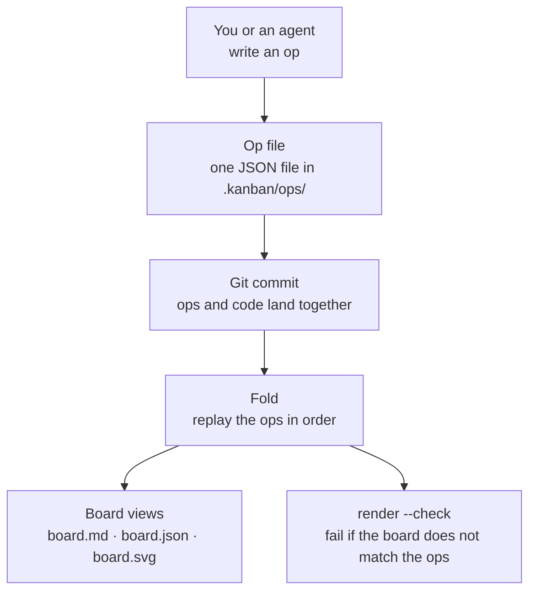
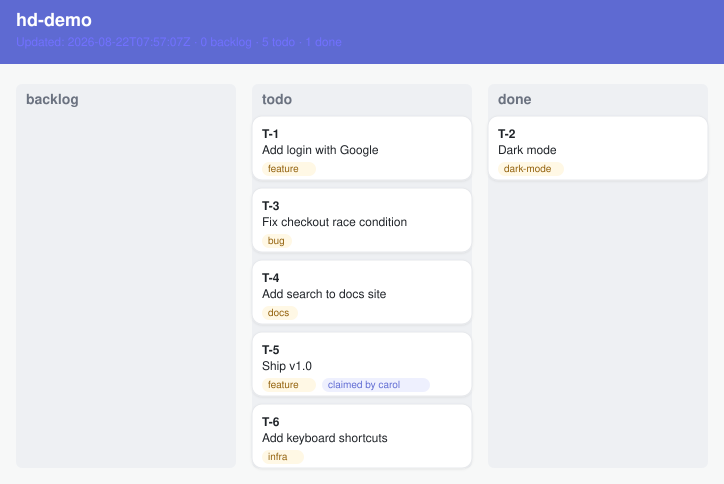

# hexdeck

[](https://github.com/danmurf/hexdeck/actions/workflows/ci.yml)
[](https://github.com/danmurf/hexdeck/actions/workflows/ci.yml)

A kanban board stored in git, built for AI agents. Tickets, columns, comments, and a progress timeline — all plain files in the repo. Agents and humans read and write the same files. No database, no server, no lock-in.

**Status: in build.** Phase 1 (core library), Phase 2 (the CLI), and Phase 3 (concurrency hardening) are done. The CLI works end to end: init a board, create and move tickets, comment, show, log, pick, release, render. Concurrent writers merge with zero conflicts — proven by an 18-scenario merge matrix. Phase 3.5 (CI pipeline) is done: lint, test, build, and `render --check` gates run on every push and PR, and the README badges show CI status and code coverage. Phase 4 (dogfood) is in progress: hexdeck tracks its own build in `.kanban/`, and `board.md` now renders ticket descriptions and comments — the board answers "where is the project up to" on its own.

## Board language

These words describe the board as a project management tool. This is the language you use day to day.

- **Board** — the whole kanban. It has four columns: `todo`, `in-progress`, `review`, `done`.
- **Ticket** — one unit of work. Each ticket has an id like `T-1` and a title.
- **Column** — where a ticket sits. A ticket is in exactly one column at a time.
- **Move** — change a ticket's column. `hexdeck move T-1 in-progress`.
- **Claim** — mark a ticket as yours. `hexdeck pick --as your-name` claims the next `todo` ticket. A claim shows who is working on the ticket.
- **Release** — clear a claim. The ticket goes back to being unclaimed.
- **Comment** — a note on a ticket. Comments are part of the ticket's history.
- **Log** — the timeline of everything that happened on the board, newest first.

## How it works

These words describe the inner workings of the app. You do not need them to use the board, but they explain why it behaves the way it does.

- **Op** — one event, stored as one JSON file in `.kanban/ops/`. Creating a ticket is an op. Moving it is an op. Every change is an op.
- **Ops are append-only** — ops are never edited or deleted. Corrections are new ops.
- **Fold** — the process that replays the ops in order to build the board state.
- **Projection** — the board files. The board is never stored; it is always rebuilt from the ops. Same ops, same board, always.
- **Render** — write the projection: `board.md` (for humans), `board.json` (for machines), `board.svg` (the image).
- **Sort order** — ops sort by `(seq, opId)`, so two writers who work at the same time never conflict when their work merges.



## The board

A real board, rendered by hexdeck from real ops:



That image is generated from the ops in `docs/demo/ops`. The board is never drawn by hand — it is always a projection of the ops. Run `hexdeck render --svg --dir docs/demo` and you get the same image, byte for byte. CI runs `hexdeck render --check --dir docs/demo` on every push — a hand-edited or stale projection fails the build.

## The dogfood board

hexdeck tracks its own build in `.kanban/` — the board is the build tracker. The phase table from PROGRESS.md migrated into tickets, and the build worker creates, moves, and comments on tickets as it works. CI runs `hexdeck render --check --dir .kanban` on every push, so the dogfood board must match its ops too. Read `.kanban/board.md` to see where the build is up to.

## Quick start

```
go install github.com/danmurf/hexdeck/cmd/hexdeck@latest
cd your-project
hexdeck init --as your-name          # create the board
hexdeck create "Fix login bug"       # new ticket
hexdeck move T-1 in-progress         # change column
hexdeck comment T-1 "on it"          # add a comment
hexdeck show                         # print the board
hexdeck log --since 2d               # what happened recently
hexdeck pick --as your-name          # claim the next todo ticket
hexdeck render --check               # CI: board files match the ops
```

Every change stages the op and the board files and prints a suggested commit message. `--commit` commits it. The board lives in `.kanban/` — read `.kanban/README.md` for the full manual.

## What exists so far

- The op schema: types, JSON parse, validation, deterministic sort.
- The fold: apply ops in order to build the board state.
- The renders: `board.md` (human-readable), `board.json` (machine view), and `board.svg` (the board image) from the board state.
- The CLI: all commands, git staging, `--commit`, pull before append.
- Concurrency hardening: the merge matrix (18 scenarios, zero conflicts), the claim-race rule, claim expiry with stale-claim display.
- The dogfood board: hexdeck tracks its own build in `.kanban/`. Anyone — human or agent — can pick up a ticket; `docs/contributing.md` explains how.

## What comes next

- Cold-start test: a fresh agent with zero context, given only the repo, creates a ticket, moves it, and comments correctly within one attempt.

## Docs

- `docs/BUILD-SPEC.md` — the full spec.
- `docs/architecture.md` — how the code is built.
- `docs/components.md` — the parts, one section each.
- `docs/contributing.md` — how to work on hexdeck, for humans and agents.
- `PROGRESS.md` — the build tracker.

## Development

```
go test ./...   # run the tests
```

Go 1.26+, stdlib only.
