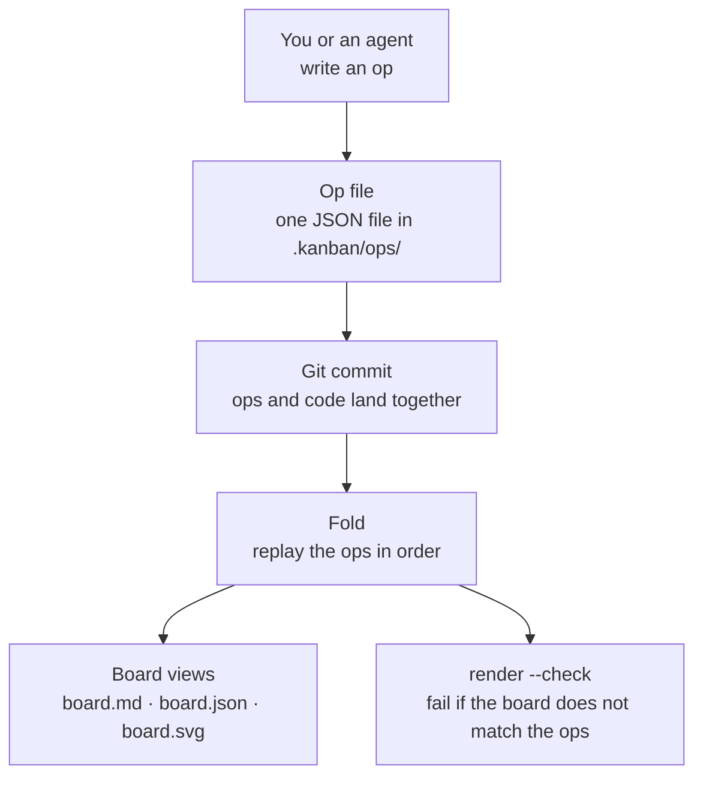

# hexdeck

A kanban board stored in git, built for AI agents. Tickets, columns, comments, and a progress timeline — all plain files in the repo. Agents and humans read and write the same files; the board is always a projection of them. No database, no server, no lock-in.

**Status: in build.** Phase 1 (core library), Phase 2 (the CLI), and Phase 3 (concurrency hardening) are done. The CLI works end to end: init a board, create and move tickets, comment, show, log, pick, release, render. Concurrent writers merge with zero conflicts — proven by an 18-scenario merge matrix. Phase 3.5 (CI pipeline) is next. Not yet dogfooded.

## How it works



- Every change to the board is an **op** — one JSON file per event in `.kanban/ops/`.
- Ops are never edited or deleted. Corrections are new ops.
- The board is rebuilt from the ops every time. Same ops, same board, always.
- Ops sort by `(seq, opId)`, so concurrent writers never conflict.

## The board

A real board, rendered by hexdeck from real ops:


That image is generated from the ops in `docs/demo/ops`. The board is never drawn by hand — it is always a projection of the ops. Run `hexdeck render --svg` in that folder and you get the same image, byte for byte.

## Quick start

```
go install github.com/danmurf/hexdeck/cmd/hexdeck@latest
cd your-project
hexdeck init --as your-name          # create the board
hexdeck create "Fix login bug"       # new ticket
hexdeck move T-1 in-progress         # change column
hexdeck comment T-1 "on it"          # add a comment
hexdeck show                         # print the board
hexdeck log --since 2d               # what happened recently
hexdeck pick --as your-name          # claim the next todo ticket
hexdeck render --check               # CI: board files match the ops
```

Every change stages the op and the board files and prints a suggested commit message. `--commit` commits it. The board lives in `.kanban/` — read `.kanban/README.md` for the full manual.

## What exists so far

- The op schema: types, JSON parse, validation, deterministic sort.
- The fold: apply ops in order to build the board state.
- The renders: `board.md` (human-readable), `board.json` (machine view), and `board.svg` (the board image) from the board state.
- The CLI: all commands, git staging, `--commit`, pull before append.
- Concurrency hardening: the merge matrix (18 scenarios, zero conflicts), the claim-race rule, claim expiry with stale-claim display.

## What comes next

- CI pipeline, then dogfood.

## Docs

- `docs/BUILD-SPEC.md` — the full spec.
- `docs/architecture.md` — how the code is built.
- `docs/components.md` — the parts, one section each.
- `PROGRESS.md` — the build tracker.

## Development

```
go test ./...   # run the tests
```

Go 1.26+, stdlib only.
