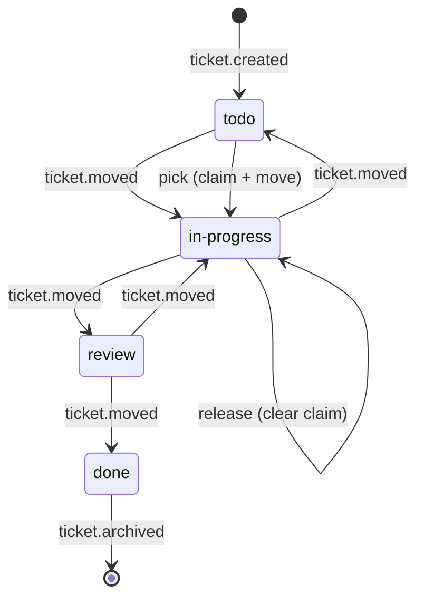

# Architecture

How hexdeck is built. Written in simplified technical English. Updated
as the code changes.

## The idea in one paragraph

hexdeck is a kanban board stored in git. Every change to the board is
an **op** — a small JSON file in `.kanban/ops/`. The board is always
rebuilt from the ops. The ops are the truth; the board is a projection.

## The parts

- **The op log** — the source of truth. One JSON file per event in
  `.kanban/ops/`. Ops are never edited or deleted — corrections are
  new ops. Code: `op.go` (schema, parse, validation, sort).
- **The projection** — the board is a pure function of the ops.
  `Project(dir)` reads the config and the ops, sorts them by
  `(seq, opId)`, and folds them into a `BoardState`. Same ops, same
  state, always. Code: `fold.go`.
- **The renders** — three views over the same `BoardState`, all
  deterministic: `board.md` (humans), `board.json` (machines),
  `board.svg` (the image). Code: `render.go`, `svg.go`.
- **The write path** — the only code that changes a board. `InitBoard`
  creates one; `AppendOp` writes one op; `RenderAll` rebuilds the
  board files; `RenderCheck` catches drift; `NextTicketID` picks the
  next ticket id. Code: `write.go`.
- **The CLI** — the `hexdeck` binary. A thin shell over the library:
  it parses flags, finds the board dir, resolves the actor name, and
  calls the library. It owns the git behaviour — staging, suggested
  commit messages, `--commit`, and pull before append. Code:
  `cmd/hexdeck/main.go`.
- **The merge matrix** — the concurrency proof. `merge_test.go` runs
  18 scenarios: two writers in two git clones append ops at the same
  time, then merge. Every scenario must merge with zero conflicts, and
  the projection must be identical on both sides after the merge.
- **The CI pipeline** — the quality gates. `.github/workflows/ci.yml`
  runs five jobs on every push and every pull request: lint (`gofmt` +
  `go vet`), test (`go test -race ./...`), build (`go build ./...`),
  render check (`hexdeck render --check` on the demo board and the
  dogfood board), and coverage badge (pushes to `main` only — measures
  coverage and writes `coverage.json`).
- **The demo board** — a real board in `docs/demo/` — config, ops, and
  the three committed projections. The README embeds its SVG. CI runs
  `render --check` on it, so a hand-edited or stale projection fails
  the build. Its claim timeout is ten years, so the projections never
  change with the wall clock — the check fails only on real drift.
- **The dogfood board** — the repo's own board in `.kanban/`. It is
  the build tracker. CI runs `render --check` on it — the same honesty
  gate as the demo board. Its claim timeout is ten years, for the same
  reason.

## Packages

### Root package (`github.com/danmurf/hexdeck`)

The core library. Eight files:

- `op.go` — the op schema. Defines the op types, the payload shapes
  (one named type per op type — `TicketCreatedPayload`,
  `TicketMovedPayload`, and so on), parses op files from a directory,
  validates them, and sorts them in a deterministic order.
- `fold.go` — the fold. Applies ops in order to build the board state.
  Also reads the board config.
- `snapshot.go` — the replay cache. `Project` folds once and reuses the
  folded state while the ops and config are unchanged. The snapshot is
  a disposable local cache — `snapshot.json` in the board dir,
  gitignored, never committed, never trusted by the renders or CI.
- `render.go` — the renders. Turns a `BoardState` into `board.md`
  (markdown) and `board.json` (JSON).
- `svg.go` — the board image. Turns a `BoardState` into `board.svg`.
- `write.go` — the write path. Creates a board (`InitBoard`), appends
  ops (`AppendOp`), picks the next ticket id (`NextTicketID`), rebuilds
  the board files (`RenderAll`), and checks them for drift
  (`RenderCheck`).
- `op_test.go`, `fold_test.go`, `render_test.go`, `svg_test.go`,
  `write_test.go`, `snapshot_test.go`, `merge_test.go` — table-driven
  tests plus golden files for the projection and the renders, and the
  merge matrix: two writers in two git clones, merged with zero
  conflicts.

### CLI package (`github.com/danmurf/hexdeck/cmd/hexdeck`)

The `hexdeck` binary. `main.go` plus `main_test.go` with end-to-end
tests in temp git repos, `web.go` plus `web_test.go` for the web view,
and `mcp.go` plus `mcp_test.go` for the MCP server. `format.go` holds
the output shapes shared by the CLI and the MCP server: the ticket
view, the op timeline, and the next-todo choice — one formatter, two
consumers, so the two surfaces cannot drift. The CLI is a thin shell
over the library: it parses flags, resolves the board dir and the
actor name, and calls the library. It never touches the board files
directly.

The commands: `init`, `create`, `move`, `comment`, `show`, `log`,
`pick`, `release`, `render`, `web`, `mcp`.

The CLI owns the git behaviour: it stages the op and the board files
after every change, prints the suggested commit message, and commits
when `--commit` is set. It runs `git pull --rebase` before appending
(skipped with `--no-pull`, or when the repo has no upstream).

## The op

One op = one JSON file. Fields: `schema`, `opId`, `seq`, `ts`,
`actor`, `type`, `ticket`, `payload`.

Op types: `board.created`, `ticket.created`, `ticket.moved`,
`ticket.updated`, `comment.added`, `ticket.claimed`,
`ticket.released`, `ticket.archived`.

## Deterministic ordering

Ops are sorted by `(seq, opId)`. Never by file order, never by
timestamp. Two writers can produce the same seq; the opId breaks the
tie. Same ops always sort the same way, so the board is always the
same.

## The projection

`Project(dir)` reads a board dir and returns a `BoardState`. It is a
pure function: same ops, same state, always.

Steps:

1. Read `config.json`. A missing file is fine — the default columns
   apply. A broken file is an error.
2. Read every op in `ops/`. Unparseable files are skipped with a
   warning, never fatal.
3. Sort the ops by `(seq, opId)`.
4. Fold: apply each op to the state in order.
5. Mark stale claims: a claim older than the claim timeout gets the
   `ClaimStale` flag.

The fold rules:

- `board.created` sets the board name.
- `ticket.created` adds a ticket in the first column. If the id
  already exists, the first one wins and the second renders a warning.
- `ticket.moved` changes the ticket's column.
- `ticket.updated` merges title and description changes.
- `comment.added` appends a comment.
- `ticket.claimed` sets the claim. A claim on an already-claimed
  ticket is a race: the first claim by `(seq, opId)` wins, the second
  renders a warning.
- `ticket.released` clears the claim.
- `ticket.archived` marks the ticket archived.

Ops about a ticket that was never created are skipped with a warning —
visible, never fatal. The board must always build.

`BoardState` holds the board name, the columns, the ticket id prefix,
the claim timeout, the tickets (a map by id), the warnings, and the
newest op ts (`Updated`). `Ticket` holds the id, title, description,
status, comments, created time, claim (who and when), the stale flag,
and the archived flag.

## The life of a ticket

## Claims

A claim is a cooperative lock, not a security boundary. Two rules make
it safe under concurrency:

- **The race rule.** Two writers can claim the same ticket. The first
  claim by `(seq, opId)` wins; the second renders a warning. The
  projection resolves the race deterministically.
- **The expiry rule.** A claim older than the claim timeout is stale.
  The projection marks it with the `ClaimStale` flag. The claim still
  stands — the flag only changes the display (`(stale claim)` in
  `board.md`, `(stale)` in the SVG badge) and lets `pick` take the
  ticket.

Staleness is computed at projection time from the wall clock. The fold
itself never reads the clock — only the staleness pass does, so the
fold stays deterministic. Tests use `projectAt`, the same projection
with an explicit clock.

## The renders

Three functions turn a `BoardState` into the committed board files.
All are deterministic: same state, same bytes, always.

- `RenderMarkdown(state)` — `board.md`, the human-readable view. A
  header with the board name, an `Updated:` line with the newest op ts
  and the ticket count per column, then one section per column.
  Tickets sort by id within a column, numerically — T-2 comes before
  T-10. Archived tickets are hidden. A ticket in a column that is not
  in the config renders in a trailing section named after the column.
  A stale claim renders `(stale claim)` after the claim. The ticket's
  description renders under its title, indented, and its comments
  render as nested bullets with the ts, actor, and text — so the board
  carries the story on its own, not just the titles.
- `RenderJSON(state)` — `board.json`, the machine view. The full
  `BoardState`, indented, with a trailing newline.
- `RenderSVG(state)` — `board.svg`, the board image for the README. A
  header with the board name and the `Updated:` line, then one column
  per configured column, side by side. Each ticket is a card: the id,
  the title, and small badges for the claim and the comment count.
  Archived tickets are hidden. A ticket in a column that is not in the
  config renders in a trailing column named after the column. A stale
  claim renders `(stale)` in the claim badge.

The `Updated:` line uses the newest op ts, so rendering is
deterministic — it never depends on the wall clock.

The SVG is deterministic by construction: a fixed layout and palette,
no external fonts, no random ids, and text is XML-escaped. The canvas
grows with the board — the width with the column count, the height
with the longest column. Both are pure functions of the state.

## Ticket ids

Ticket ids are `<prefix>-<number>`. The prefix comes from
`config.json` (`ticketPrefix`), set at `hexdeck init --prefix`
(default `T`). `NextTicketID` returns the highest numeric suffix plus
one. Tickets sort numerically within a column, whatever the prefix —
`HDX-2` comes before `HDX-10`.

## The write path

`write.go` is the only code that changes a board:

- `InitBoard(dir, name, prefix, actor)` creates `.kanban/` — the
  primer README, the config, the `board.created` op, and the rendered
  board files — plus the AGENTS.md discovery hook. It fails if the
  board already exists.
- `AppendOp(opsDir, op)` writes one op file. It fills the seq (highest
  seen plus one), the opId (a random UUID), the ts (now, UTC), and the
  schema. The op is validated first — nothing is written for an
  invalid op.
- `RenderAll(boardDir, svg)` rebuilds `board.md` and `board.json` from
  the ops, plus `board.svg` when asked.
- `RenderCheck(boardDir)` compares the committed board files to a
  fresh render. It returns an error naming the first file that
  drifted. CI runs it. `board.svg` is checked only when it exists — it
  is opt-in via `render --svg`.

## The CI pipeline

`.github/workflows/ci.yml` runs five jobs on every push and every pull
request:

- **Lint** — `gofmt -l .` must print nothing, then `go vet ./...` must
  pass.
- **Test** — `go test -race ./...`.
- **Build** — `go build ./...`.
- **Render check** — builds the CLI and runs
  `hexdeck render --check --dir docs/demo`, then
  `hexdeck render --check --dir .kanban`. Both committed boards must
  match their ops. A hand-edited or stale projection fails the job.
  Then the board.svg honesty step: it re-renders the demo board's SVG,
  compares it to the image at the repo root with `cmp`, and fails if
  the committed image drifted. The README embeds that image, so the
  board on the repo homepage is always the projection of the ops.
- **Coverage badge** — runs only on pushes to `main`. It runs
  `HEXDECK_E2E_COVER=1 go test -coverpkg=./... -count=1
  -coverprofile=coverage.out ./...`, reads the total from
  `go tool cover -func`, and writes `coverage.json` — a shields.io
  endpoint badge file. If the number changed, it commits and pushes
  the file. The README badge reads it through
  `img.shields.io/endpoint`.

The jobs use the Go version from `go.mod` (`go-version-file`), so the
pipeline and the local toolchain never drift apart.

The demo board in `docs/demo/` is a real board (config, ops, and the
three committed projections) that CI checks on every run. Its claim
timeout is ten years, so the committed projections never change with
the wall clock — the check fails only on real drift.

## The dogfood board

The repo's own board lives in `.kanban/`. It is the build tracker: the
build worker creates, moves, and comments on tickets as it works. CI
checks it with `hexdeck render --check --dir .kanban` — the same
honesty gate as the demo board. Its claim timeout is ten years, for
the same reason: the committed projections never change with the wall
clock.

The merge rule applies to the dogfood board: a ticket in `review` is
done when its PR merges. The worker moves it to `done` as an ops-only
commit straight to main — no second PR.

`docs/contributing.md` is the contribution guide — for humans and
agents alike. It describes how the board is used (`pick` a ticket,
`comment` at milestones, `move <ticket> review` at the end, the
same-commit rule), the quality bar, and the rules. A fresh agent with
zero context reads it once and can run a piece of work.

## The README badges

Two badges sit under the README title:

- **CI** — a shields.io GitHub Actions badge for the `ci.yml` workflow
  on `main`. It shows the state of the last run. No account needed.
- **Coverage** — a shields.io endpoint badge. It reads `coverage.json`
  from the repo. The coverage job in CI writes that file after every
  push to `main`, so the badge always shows the real number.

The coverage number is the honest total across both packages. The
CLI's end-to-end tests run the binary as a subprocess. Go's default
coverage tool cannot see subprocesses, so the number was a measurement
artifact. The fix: `HEXDECK_E2E_COVER` makes the E2E test build the
binary with `-cover -coverpkg=./...`, and the go command merges the
subprocess coverage into the profile. The badge shows that merged
value. The contract is pinned: `TestCoverageBadgeHonest` fails if the
badge drops below 80%.

The contract is tested: `ci_test.go` reads the real workflow, badge
file, and README, and fails if the coverage job, the badge schema, or
the badge links are missing.

## The board image on the homepage

The README embeds `board.svg` at the repo root — the board image, so
GitHub shows the live board on the repo homepage. The image is a
projection of the demo board's ops in `docs/demo/ops`. It is never
drawn by hand.

CI keeps it honest. The render-check job re-renders the demo board's
SVG, compares it to the image at the repo root with `cmp`, and fails
if the committed image drifted. The contract is pinned:
`TestBoardSVGInWorkflow` checks the workflow has the honesty step, and
`TestReadmeEmbedsBoardSVG` checks the README embeds the image.

## The web view

`hexdeck web` serves the local web view at `http://127.0.0.1:8080`.
One HTML page, no build step, no external assets. The page shows the
board; drag a ticket to move it, type in the box on a ticket to
comment. A changes panel lists every change, shows the staged diff,
and holds the suggested commit message — edit it and press Commit.

The page is a render, like `board.md` and `board.svg`: it is embedded
in the binary as one deterministic HTML file, pinned by a golden test
(`TestWebPageGolden`). Cards show id, title and badges; a click on the
title expands the description and comments. The page never touches the
board files itself — it talks to the API endpoints the server exposes:

- `GET /api/state` — the projection.
- `POST /api/move` — move a ticket. Body: `{"ticket": "T-1", "to":
  "in-progress"}`.
- `POST /api/comment` — add a comment. Body: `{"ticket": "T-1",
  "text": "on it"}`.
- `GET /api/changes` — the changes panel: the list, the staged diff,
  the suggested message. On a fresh server the list is an empty array,
  never null — the page renders an empty panel (`TestWebChangesEmpty`).
- `POST /api/commit` — commit the staged changes. Optional body:
  `{"message": "..."}` — the message the user edited.

Every write goes through the same path as the CLI — `AppendOp`,
`RenderAll`, git staging, pull before append — so the web view and the
CLI can never disagree about the board. The changes panel is the
GitHub Desktop pattern: diff → suggested message → commit. The server
binds to 127.0.0.1 only; it is a local tool, not a service.

## The MCP server

`hexdeck mcp` serves the board as an MCP server over stdio. An agent
harness starts the process and talks to it with newline-delimited
JSON-RPC messages — the MCP protocol, version 2025-06-18. The agent
asks the board questions without the CLI.

The server exposes four tools, all read-only:

- `board_show` — the whole board as markdown.
- `board_show_ticket` — one ticket: title, description, status,
  claim, comments.
- `board_log` — the op timeline, with the same filters as
  `hexdeck log` (`ticket`, `actor`, `since`).
- `board_next` — the next todo ticket to pick, chosen the same way
  `hexdeck pick` chooses it.

The session is one JSON-RPC message per line: the server reads a line,
answers it, and writes the response as one line. The handshake is the
standard MCP one — `initialize` answers with the protocol version, the
tools capability, and the server name; `tools/list` answers with the
tool list; `tools/call` runs one tool. A malformed line gets a parse
error response, and the session survives. Notifications get no
response.

The tool list is a render, like `board.md` and the web page: it is
deterministic and pinned by a golden test (`TestMCPToolsListGolden`).
Every tool answers from the projection — the server never writes to
the board. Stdout carries the protocol; the board dir is printed to
stderr.

## What comes next

V1.1 — only if V1 earns it: snapshot checkpointing.

Full plan: `docs/BUILD-SPEC.md`.
